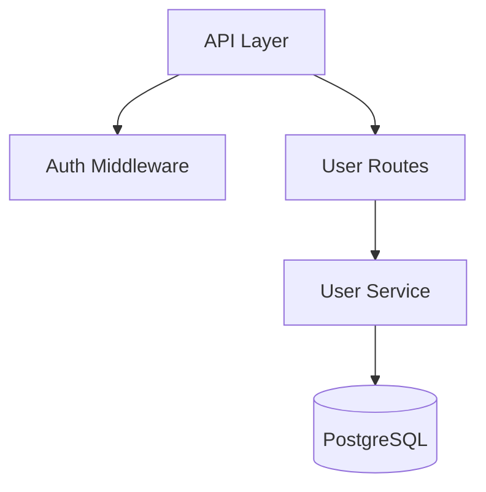

# Quick Start Guide

Get up and running with export-conversation in under 2 minutes!

## Installation

### Option 1: One-Line Install (Recommended)

```bash
git clone https://github.com/akoserwal/export-conversation-skill.git && cd export-conversation-skill && ./install.sh
```

### Option 2: Manual Install

```bash
# Clone the repository
git clone https://github.com/akoserwal/export-conversation-skill.git

# Create symlink to Claude skills directory
ln -s $(pwd)/export-conversation-skill ~/.claude/skills/export-conversation
```

### Verify Installation

```bash
ls ~/.claude/skills/export-conversation/SKILL.md
```

If you see the file, you're ready to go! ✅

## First Export

1. **Open a Claude Code session**
2. **Have a conversation** (try asking Claude to help you with some code)
3. **Export it:**
   ```
   /export-conversation my-first-export
   ```

That's it! You'll find `my-first-export.md` in your current directory.

## Basic Usage

### Auto-Timestamped Export
```
/export-conversation:export
```
Creates: `conversation-export-2026-04-08-143022.md`

### Named Export
```
/export-conversation:export feature-planning
```
Creates: `feature-planning.md`

### Export to Specific Directory
```
/export-conversation:export docs/sessions/code-review
```
Creates: `docs/sessions/code-review.md`

## What You'll Get

Every export includes:

- ✅ **Full conversation** - Every message in chronological order
- ✅ **Tool usage** - All commands run, files read/written
- ✅ **Statistics** - Message counts, files changed, outcomes
- ✅ **Diagrams** - Auto-generated for architecture discussions
- ✅ **File changes** - What was created/modified/deleted

## Example Use Cases

### 1. Document a Bug Fix
```
/export-conversation bug-123-null-pointer-fix
```
Perfect for adding to bug reports or team wikis.

### 2. Archive Architecture Decisions
```
/export-conversation docs/decisions/api-redesign-2026-04
```
Keep a record of why you made certain architectural choices.

### 3. Create Learning Material
```
/export-conversation tutorials/how-we-implemented-auth
```
Turn your conversations into tutorials for your team.

### 4. Code Review Sessions
```
/export-conversation reviews/pr-456-review
```
Document feedback and decisions from code reviews.

## Understanding Diagrams

Diagrams are automatically included when you discuss:

- 🏗️ **Architecture** - "How should we structure this?"
- 🔄 **Flows** - "What's the process for X?"
- 📁 **File Structure** - "Let's create these files..."
- 🔀 **Git Operations** - "Create a feature branch..."

### Example: Architecture Discussion

**Your conversation:**
> "Let's build an API with authentication, user management, and a database layer"

**Export will include:**


## Pro Tips

### 1. Export Often
Don't wait until the end of a long session - export important milestones:
```
/export-conversation checkpoint-1
# ... more work ...
/export-conversation checkpoint-2
```

### 2. Organize with Directories
```
/export-conversation docs/2026/april/week-1
```

### 3. Name by Feature or Task
```
/export-conversation feature-user-authentication
/export-conversation bug-fix-memory-leak
/export-conversation refactor-database-layer
```

### 4. Review Before Sharing
Check your export for sensitive data before sharing with team:
```bash
# Exports sanitize common secrets, but always review
cat my-export.md | grep -i "password\|secret\|key"
```

## Viewing Exports

### In GitHub/GitLab
Diagrams render automatically! Just commit and push:
```bash
git add docs/sessions/my-export.md
git commit -m "docs: Add architecture planning session"
git push
```

### In VS Code
Install Markdown Preview:
- Press `Cmd+Shift+P` (Mac) or `Ctrl+Shift+P` (Windows)
- Type "Markdown: Open Preview"
- Diagrams render inline!

### In Obsidian
Obsidian has native Mermaid support - diagrams work out of the box.

## Troubleshooting

### "Skill not found"
```bash
# Verify installation
ls ~/.claude/skills/export-conversation/SKILL.md

# Restart Claude Code CLI
```

### "Permission denied"
```bash
# Fix permissions
chmod 644 ~/.claude/skills/export-conversation/SKILL.md
```

### "No diagrams in my export"
Diagrams are only included for architectural discussions. Try:
- Discussing system design
- Creating file structures
- Explaining workflows

## Next Steps

- 📖 Read the full [README.md](./README.md) for advanced features
- 🔍 Check out [example exports](./examples/) for inspiration
- 💡 See [CONTRIBUTING.md](./CONTRIBUTING.md) to help improve the skill
- 🐛 Report issues or request features on [GitHub](https://github.com/YOUR_USERNAME/export-conversation-skill/issues)

## Need Help?

- 📚 Read the [README](./README.md)
- 💬 Start a [Discussion](https://github.com/YOUR_USERNAME/export-conversation-skill/discussions)
- 🐛 Open an [Issue](https://github.com/YOUR_USERNAME/export-conversation-skill/issues)

Happy exporting! 🚀
