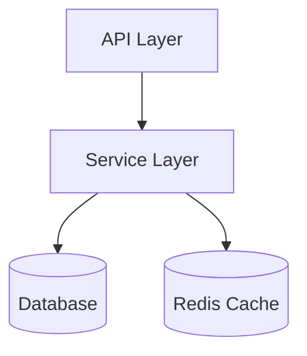

# Export Conversation - Claude Code Skill

> 📝 Export your Claude Code conversation sessions to beautifully formatted markdown files with diagrams, statistics, and full conversation history.

[](https://claude.ai/code)
[](./LICENSE)

## Features

✨ **Comprehensive Exports** - Captures complete conversation history with user messages, assistant responses, and all tool usage

📊 **Visual Diagrams** - Automatically generates Mermaid diagrams for:
- Code architecture and system design
- Process flows and workflows  
- Sequence diagrams for API calls
- File structure trees
- Git operations and branching
- State machines and data flows

📈 **Session Statistics** - Tracks files modified, commands executed, and key outcomes

🎯 **Flexible Output** - Auto-timestamped files or custom naming

🔒 **Privacy-Aware** - Sanitizes sensitive information (API keys, passwords)

## Quick Start

### Installation

1. **Clone or download this repository:**
   ```bash
   git clone https://github.com/YOUR_USERNAME/export-conversation-skill.git
   ```

2. **Install the skill:**
   ```bash
   # Copy to Claude Code skills directory
   cp -r export-conversation-skill ~/.claude/skills/export-conversation
   
   # Or create a symlink for easier development
   ln -s $(pwd)/export-conversation-skill ~/.claude/skills/export-conversation
   ```

3. **Verify installation:**
   ```bash
   ls ~/.claude/skills/export-conversation/SKILL.md
   ```

The skill is now available in all your Claude Code sessions!

## Usage

### Basic Usage

Export current conversation with auto-generated timestamp:
```bash
/export-conversation
```
Creates: `conversation-export-2026-04-08-203940.md`

### Custom Filename

Export to a specific filename:
```bash
/export-conversation my-session
```
Creates: `my-session.md`

### Custom Path

Export to a specific directory:
```bash
/export-conversation docs/sessions/planning-session
```
Creates: `docs/sessions/planning-session.md`

## What Gets Exported

Each export includes:

### 1. Session Metadata
- Export timestamp
- Working directory
- Conversation summary (2-3 paragraph overview)

### 2. Visual Overview (When Applicable)
Automatically generated Mermaid diagrams for:
- **Architecture diagrams** - Component relationships and dependencies
- **Sequence diagrams** - API calls, method invocations, request/response flows
- **Flowcharts** - Process flows, decision trees, workflows
- **File structure** - Directory trees and file organization
- **Git graphs** - Branching strategies and commit history
- **State diagrams** - State machines and UI states
- **ER diagrams** - Database schemas and entity relationships

### 3. Full Conversation History
- Chronological message-by-message capture
- User messages and assistant responses
- All tool calls with descriptions (Bash, Read, Write, Edit, etc.)
- Errors encountered and resolutions
- Code snippets (when relevant)

### 4. Session Statistics
- Total message count
- Files created and modified
- Commands executed
- Key outcomes and achievements

### 5. File Change Log
Detailed documentation for each file:
- Action taken (Created/Modified/Deleted)
- Description of changes
- Relevant code snippets

## Examples

### Example 1: Simple Export

```bash
/export-conversation
```

**Output:**
```
✓ Conversation exported to: /Users/you/project/conversation-export-2026-04-08-143022.md

The export includes:
- Full conversation history (12 messages)
- 3 files modified
- 8 commands executed
- 0 Mermaid diagrams
- Session summary and statistics
```

### Example 2: Export with Diagrams

When you discuss architecture, the skill automatically includes relevant diagrams:

```bash
/export-conversation architecture-planning
```

**Output:**
```
✓ Conversation exported to: /Users/you/project/architecture-planning.md

The export includes:
- Full conversation history (25 messages)
- 8 files modified
- 15 commands executed
- 4 Mermaid diagrams
- Session summary and statistics
```

The export will contain diagrams like:



### Example 3: Review Session Export

```bash
/export-conversation code-review-session
```

Perfect for documenting:
- Code review discussions
- Bug investigation sessions
- Architecture planning meetings
- Feature development sessions
- Debugging sessions

## When to Use

**Perfect for:**
- 📚 **Documentation** - Create permanent records of important sessions
- 🔍 **Code Reviews** - Export review discussions with full context
- 🏗️ **Architecture Planning** - Capture design decisions with diagrams
- 🐛 **Bug Investigations** - Document debugging sessions step-by-step
- 📖 **Learning** - Save educational sessions for future reference
- 🤝 **Team Sharing** - Share conversation context with team members
- 📝 **Project History** - Build a knowledge base of project decisions

## Diagram Support

The skill intelligently determines when to create diagrams based on conversation content:

| Diagram Type | Use Case | Example |
|--------------|----------|---------|
| `graph TD/LR` | Architecture, dependencies, file trees | Component relationships |
| `sequenceDiagram` | API calls, method flows | Request/response patterns |
| `flowchart` | Processes, decision trees | Workflow logic |
| `classDiagram` | OOP design, class relationships | Class hierarchies |
| `stateDiagram-v2` | State machines, UI states | State transitions |
| `gitGraph` | Git operations, branching | Branch strategies |
| `erDiagram` | Database schemas | Entity relationships |

### Diagram Quality Standards

The skill ensures diagrams are:
- ✅ Focused on one concept per diagram
- ✅ Using clear, descriptive labels
- ✅ Showing actual names from your conversation
- ✅ Indicating flow direction with arrows
- ✅ Self-explanatory with context

## Privacy & Security

- **Automatic sanitization** - Sensitive data (API keys, passwords) replaced with `[REDACTED]`
- **Local-only** - Exports are saved to your local filesystem
- **No external uploads** - Your conversations stay on your machine

## File Structure

```
export-conversation-skill/
├── SKILL.md                 # Skill definition and instructions
├── README.md               # This file
├── LICENSE                 # MIT License
└── examples/               # Example exports
    ├── simple-export.md
    ├── with-diagrams.md
    └── architecture-session.md
```

## Advanced Tips

### 1. Create a Documentation Workflow

Add to your `.claude/CLAUDE.md`:
```markdown
# Project Documentation
After completing significant features or architectural decisions, 
run `/export-conversation feature-name` to document the session.
```

### 2. Combine with Git

```bash
# After a productive session
/export-conversation feature-auth-implementation

# Add to git
git add docs/sessions/feature-auth-implementation.md
git commit -m "docs: Add session notes for auth implementation"
```

### 3. Team Knowledge Base

Export important sessions to a shared docs folder:
```bash
/export-conversation docs/team-sessions/2026-04-08-api-redesign
```

## Troubleshooting

### Skill Not Found

If `/export-conversation` is not recognized:

1. Verify installation:
   ```bash
   ls ~/.claude/skills/export-conversation/SKILL.md
   ```

2. Check file permissions:
   ```bash
   chmod 644 ~/.claude/skills/export-conversation/SKILL.md
   ```

3. Restart Claude Code CLI or reload your session

### Exports Missing Diagrams

Diagrams are only included when:
- Code architecture or system design was discussed
- Process flows or workflows were created
- File/directory structure was modified
- Component relationships were explained

For simple Q&A sessions without architectural discussion, no diagrams are generated.

### Custom Diagram Requests

If you want to ensure diagrams are included, explicitly discuss architecture during your session:
- "Let's diagram the component architecture"
- "Show me the flow of this process"
- "What's the file structure we created?"

## Contributing

Contributions are welcome! Here's how:

1. Fork the repository
2. Create a feature branch: `git checkout -b feature/amazing-improvement`
3. Make your changes to `SKILL.md`
4. Test thoroughly in a Claude Code session
5. Commit with clear messages: `git commit -m 'feat: Add support for X'`
6. Push to your fork: `git push origin feature/amazing-improvement`
7. Open a Pull Request

### Development Setup

```bash
# Clone your fork
git clone https://github.com/YOUR_USERNAME/export-conversation-skill.git

# Create symlink for development
ln -s $(pwd)/export-conversation-skill ~/.claude/skills/export-conversation

# Make changes to SKILL.md
# Test in Claude Code with /export-conversation
# Changes take effect immediately
```

## Changelog

### v2.0.0 - 2026-04-08
- ✨ Added comprehensive Mermaid diagram support
- ✨ 7 diagram types: graph, sequence, flowchart, class, state, git, ER
- 📝 Enhanced Visual Overview section
- 📝 Diagram quality standards and guidelines
- 🎯 Smart diagram inclusion based on conversation content

### v1.0.0 - 2026-04-08
- 🎉 Initial release
- ✨ Basic conversation export functionality
- ✨ Session statistics tracking
- ✨ File change logging
- ✨ Flexible output naming (timestamp or custom)
- 🔒 Sensitive data sanitization

## License

MIT License - see [LICENSE](./LICENSE) file for details

## Acknowledgments

Built for [Claude Code](https://claude.ai/code) by Anthropic

## Support

- 🐛 [Report Issues](https://github.com/YOUR_USERNAME/export-conversation-skill/issues)
- 💡 [Request Features](https://github.com/YOUR_USERNAME/export-conversation-skill/issues/new)
- 📖 [Claude Code Documentation](https://docs.anthropic.com/claude/docs/claude-code)

---

**Made with ❤️ for the Claude Code community**
