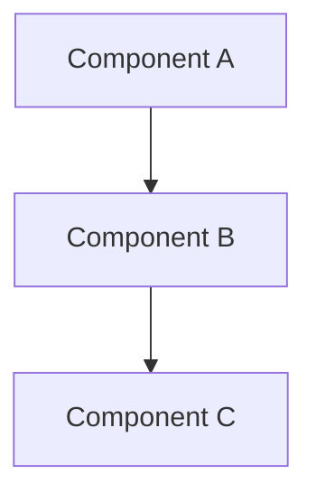
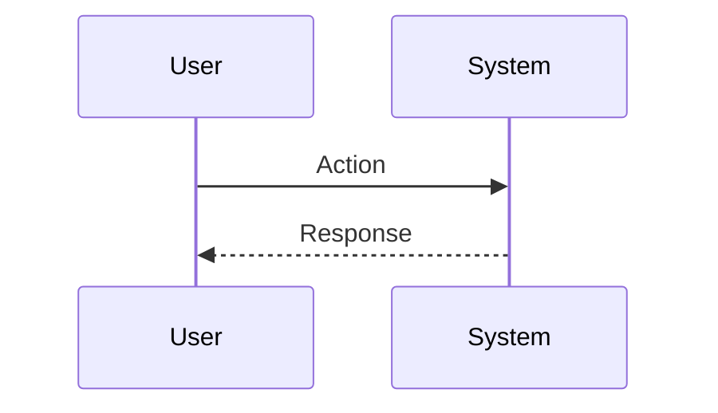
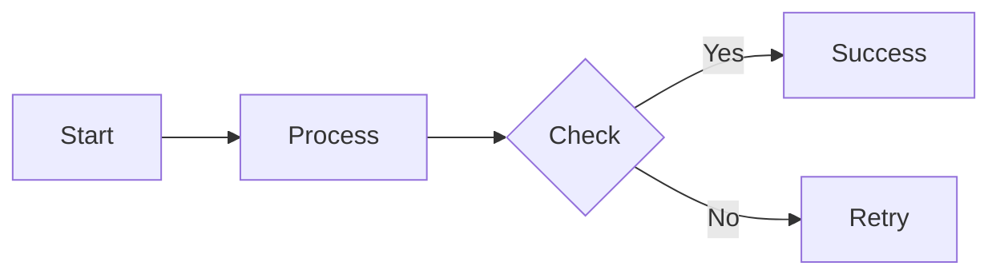
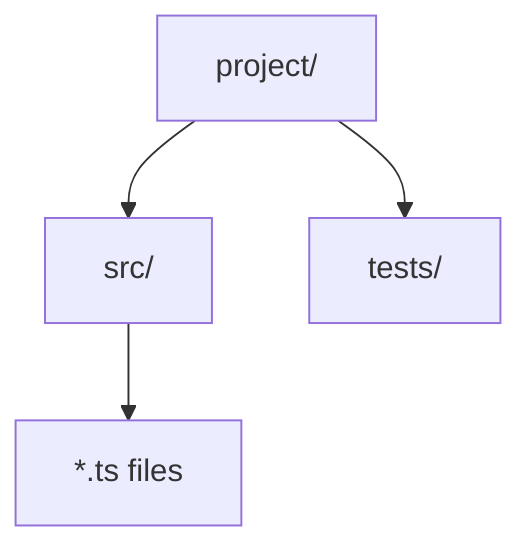

# /export-conversation

Export the current conversation session to a well-formatted markdown file with timestamps, user messages, assistant responses, and tool usage summary.

## Usage

```
/export-conversation                    # export to ./conversation-export-[timestamp].md
/export-conversation <filename>         # export to specific filename (adds .md if missing)
/export-conversation <path/filename>    # export to specific path
```

## What You Must Do When Invoked

### Step 1 - Determine output path

If the user provided a filename or path:
- Use it as-is if it ends with `.md`
- Otherwise append `.md` to it
- If it's just a filename (no path), save to current working directory

If no filename provided:
- Generate: `conversation-export-YYYY-MM-DD-HHmmss.md` using current timestamp
- Save to current working directory

### Step 2 - Review the conversation

Carefully review the ENTIRE conversation from the beginning. Identify:
- All user messages and their timestamps (if available)
- All assistant responses
- All tool calls made (Bash, Read, Write, Edit, etc.) and their purposes
- Key decisions, code changes, or important outcomes
- Any errors encountered and how they were resolved
- Code architecture, patterns, and relationships discussed
- Process flows, sequences, or workflows explained
- System designs or component interactions
- Data flows or state transitions

### Step 3 - Format the export

Create a well-structured markdown document with this format:

```markdown
# Conversation Export

**Exported:** [Current date and time]
**Working Directory:** [CWD at time of export]

---

## Conversation Summary

[2-3 paragraph summary of what was accomplished in this session, key topics discussed, main outcomes]

---

## Visual Overview

[If applicable, include Mermaid diagrams that capture key aspects of the conversation:]

### Architecture Diagram
[If code architecture, system design, or component relationships were discussed, create a Mermaid graph/flowchart]



### Code Flow Diagram
[If specific code execution flows or sequences were discussed, create a Mermaid sequence diagram]



### Process Flow
[If workflows or processes were created/modified, create a Mermaid flowchart]



### File Structure
[If file/directory structure was significant, create a tree diagram]



---

## Full Conversation

### [Timestamp or sequence number] User

[User's message]

### [Timestamp or sequence number] Assistant

[Assistant's response - include both explanatory text and describe actions taken]

**Actions taken:**
- [Tool used]: [Purpose/outcome]
- [Tool used]: [Purpose/outcome]

[Continue for entire conversation...]

---

## Session Statistics

- **Total messages:** [count]
- **Files modified:** [list of files]
- **Files created:** [list of files]
- **Commands run:** [count]
- **Key outcomes:** [bullet list of main achievements]

---

## Files Changed

[For each file that was created or modified, include:]

### `path/to/file.ext`
- **Action:** Created/Modified/Deleted
- **Changes:** [Brief description]

---

*Generated by Claude Code - Conversation Export Skill*
```

### Step 4 - Write the export file

Use the Write tool to create the markdown file with the formatted content.

### Step 5 - Confirm to user

Print a message:
```
✓ Conversation exported to: [full path to file]

The export includes:
- Full conversation history ([N] messages)
- [M] files modified
- [K] commands executed
- [L] Mermaid diagrams
- Session summary and statistics
```

## Important Guidelines

### General
- Be thorough - capture the ENTIRE conversation, not just recent messages
- Preserve the flow and context of the discussion
- Include actual code snippets if they're short and relevant to understanding the conversation
- For long code files, just reference them by path rather than including full content
- Maintain chronological order
- Use clear section headers and formatting for readability
- If the conversation is very long (>100 exchanges), consider adding a table of contents
- Sanitize any sensitive information (API keys, passwords) if present - replace with `[REDACTED]`

### Diagrams and Visual Representations
- **Always include** a Visual Overview section if the conversation involved:
  - Code architecture or system design
  - Process flows or workflows
  - Sequences of operations or API calls
  - File/directory structure creation or modification
  - Component relationships or dependencies
  - State machines or transitions
  - Data flows or pipelines
  - Git branching or commit history

- **Use Mermaid diagrams** for visual representation:
  - `graph TD/LR` for architecture, dependencies, file trees
  - `sequenceDiagram` for API calls, method invocations, request/response flows
  - `flowchart` for logic flows, decision trees, processes
  - `classDiagram` for object-oriented designs, class relationships
  - `stateDiagram-v2` for state machines, UI states
  - `gitGraph` for git operations, branching strategies
  - `erDiagram` for database schemas, entity relationships

- **Diagram quality standards**:
  - Keep diagrams focused - one concept per diagram
  - Use clear, descriptive labels
  - Show actual file names, function names, or component names from the conversation
  - Indicate direction of flow with arrows
  - Group related components visually
  - Add notes/annotations for complex relationships
  - Ensure diagrams are self-explanatory with the conversation context

- **When to create diagrams**:
  - If files were created/modified in multiple directories → file structure diagram
  - If functions call each other → sequence diagram
  - If components/modules interact → architecture diagram
  - If there's a workflow or process → flowchart
  - If there's decision logic → flowchart with decision nodes
  - If git operations were performed → git graph
  - If discussing how data flows → data flow diagram

- **Skip diagrams only if**:
  - The conversation was purely Q&A with no code/system discussion
  - Only trivial single-file edits were made
  - No architectural or flow concepts were discussed

## Edge Cases

- If conversation is empty or just started, create a minimal export noting this
- If unable to determine timestamps, use sequence numbers (Message 1, Message 2, etc.)
- If CWD changed during session, note this in the export
- For tool calls that failed, include the error and resolution in the export
