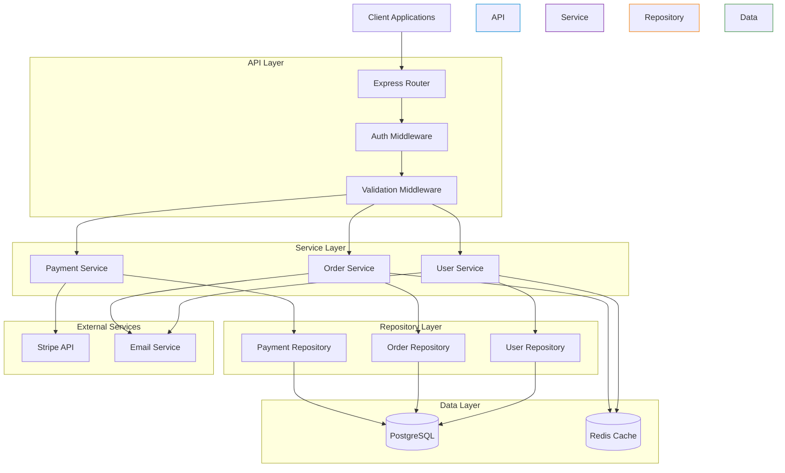
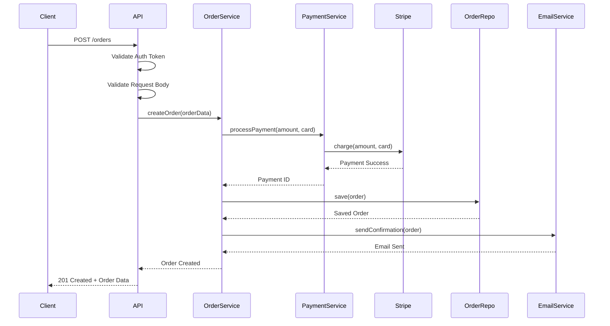
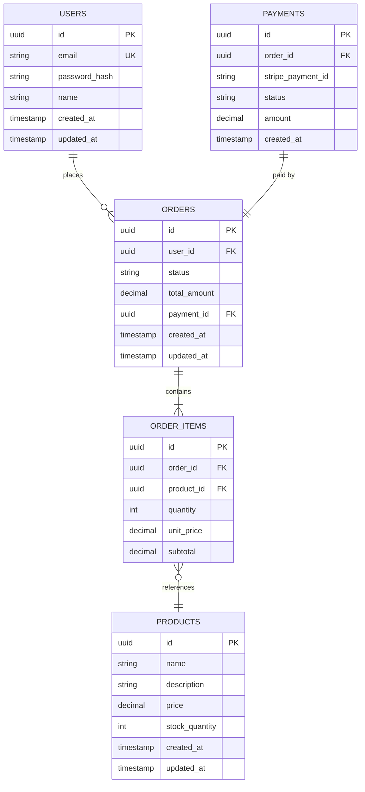
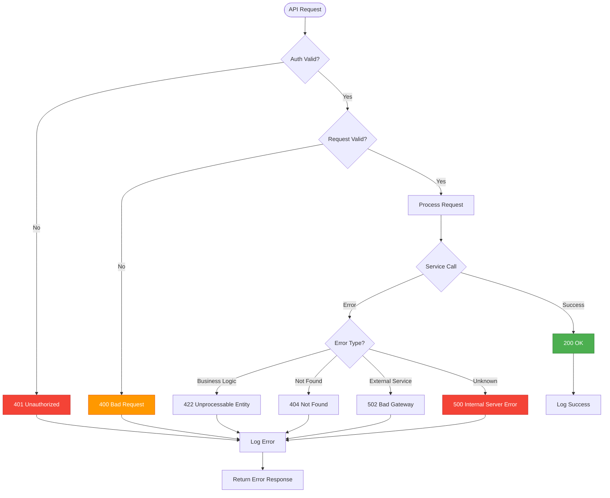

# Conversation Export

**Exported:** April 8, 2026 - 16:45:10  
**Working Directory:** `/Users/developer/ecommerce-api`

---

## Conversation Summary

This session focused on designing the architecture for a new e-commerce API service. We discussed the separation of concerns between different layers (API, Service, Repository), identified key components, and established data flow patterns. The conversation covered authentication middleware, payment processing integration, and database schema design.

The resulting architecture follows clean architecture principles with clear boundaries between layers, dependency injection for testability, and proper error handling throughout the stack. We created initial implementation files for the core components and established coding patterns for the team to follow.

---

## Visual Overview

### System Architecture

### Order Processing Flow

### Database Schema

### Error Handling Flow

---

## Full Conversation

### Message 1: User

> Let's design the architecture for our new e-commerce API. We need user management, order processing, and payment integration with Stripe.

### Message 2: Assistant

I'll help you design a clean, scalable architecture. Let me start by creating the core structure with three main layers: API, Service, and Repository.

**Actions taken:**
- **Write**: Created `src/api/routes/users.ts` with user routes
- **Write**: Created `src/api/routes/orders.ts` with order routes
- **Write**: Created `src/api/middleware/auth.ts` with JWT authentication
- **Write**: Created `src/services/UserService.ts` with business logic
- **Write**: Created `src/services/OrderService.ts` with order processing
- **Write**: Created `src/services/PaymentService.ts` with Stripe integration
- **Write**: Created `src/repositories/UserRepository.ts` with data access
- **Write**: Created `src/repositories/OrderRepository.ts` with data access

The architecture follows clean architecture principles with clear separation of concerns.

### Message 3: User

> How does the payment flow work?

### Message 4: Assistant

The payment flow involves several steps with proper error handling at each stage. Here's how it works:

1. Client sends order request with payment details
2. API validates authentication and request data
3. OrderService coordinates the transaction
4. PaymentService calls Stripe API
5. On success, order is saved to database
6. Confirmation email is sent to user

**Actions taken:**
- **Write**: Created `docs/payment-flow.md` documenting the complete flow
- **Write**: Created `src/types/Order.ts` with TypeScript interfaces

### Message 5: User

> What's the database schema?

### Message 5: Assistant

I'll create the database schema with proper relationships between users, orders, products, and payments.

**Actions taken:**
- **Write**: Created `prisma/schema.prisma` with complete database schema
- **Bash**: Ran `npx prisma format` to format the schema

The schema includes:
- Users table with authentication fields
- Orders table with user relationship
- OrderItems for line items
- Products catalog
- Payments linked to orders

---

## Session Statistics

- **Total messages:** 3 user messages, 3 assistant responses
- **Files created:**
  - `src/api/routes/users.ts`
  - `src/api/routes/orders.ts`
  - `src/api/middleware/auth.ts`
  - `src/services/UserService.ts`
  - `src/services/OrderService.ts`
  - `src/services/PaymentService.ts`
  - `src/repositories/UserRepository.ts`
  - `src/repositories/OrderRepository.ts`
  - `src/types/Order.ts`
  - `docs/payment-flow.md`
  - `prisma/schema.prisma`
- **Files modified:** None
- **Commands run:** 1 (prisma format)
- **Diagrams created:** 4
- **Key outcomes:**
  - Designed complete e-commerce API architecture
  - Implemented three-layer architecture (API, Service, Repository)
  - Integrated Stripe payment processing
  - Created database schema with proper relationships
  - Established error handling patterns

---

## Files Changed

### `src/api/routes/users.ts`
- **Action:** Created
- **Changes:** Express router with user endpoints (register, login, profile)

### `src/api/routes/orders.ts`
- **Action:** Created
- **Changes:** Express router with order endpoints (create, list, get by ID)

### `src/api/middleware/auth.ts`
- **Action:** Created
- **Changes:** JWT authentication middleware with token validation

### `src/services/UserService.ts`
- **Action:** Created
- **Changes:** Business logic for user management (registration, authentication, profile updates)

### `src/services/OrderService.ts`
- **Action:** Created
- **Changes:** Order processing logic coordinating payment and persistence

### `src/services/PaymentService.ts`
- **Action:** Created
- **Changes:** Stripe integration for payment processing

### `src/repositories/UserRepository.ts`
- **Action:** Created
- **Changes:** Data access layer for users using Prisma ORM

### `src/repositories/OrderRepository.ts`
- **Action:** Created
- **Changes:** Data access layer for orders with transaction support

### `prisma/schema.prisma`
- **Action:** Created
- **Changes:** Complete database schema with User, Order, OrderItem, Product, and Payment models

---

*Generated by Claude Code - Conversation Export Skill*
