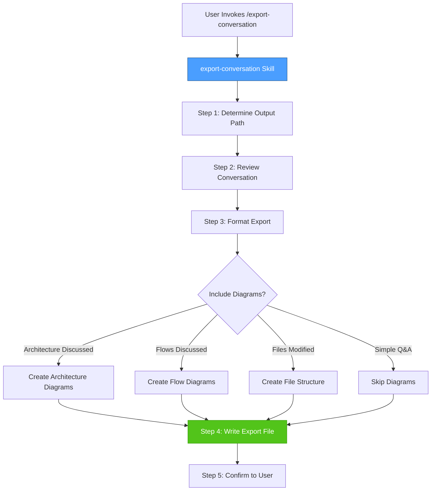
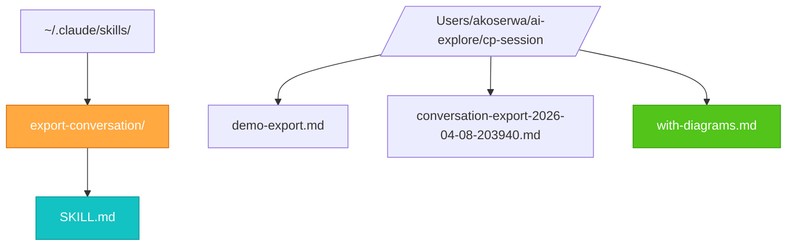
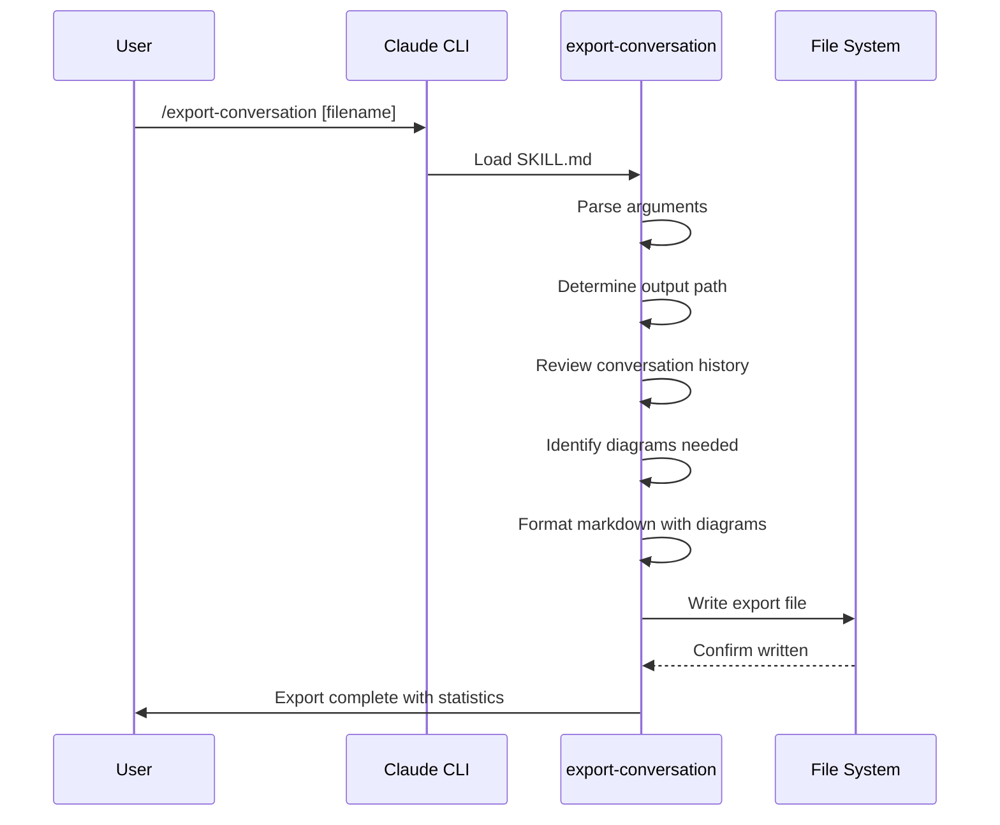
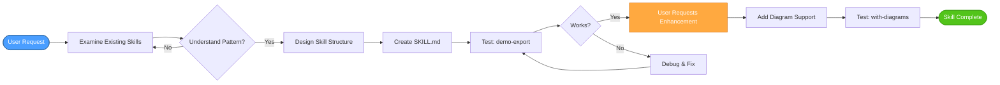
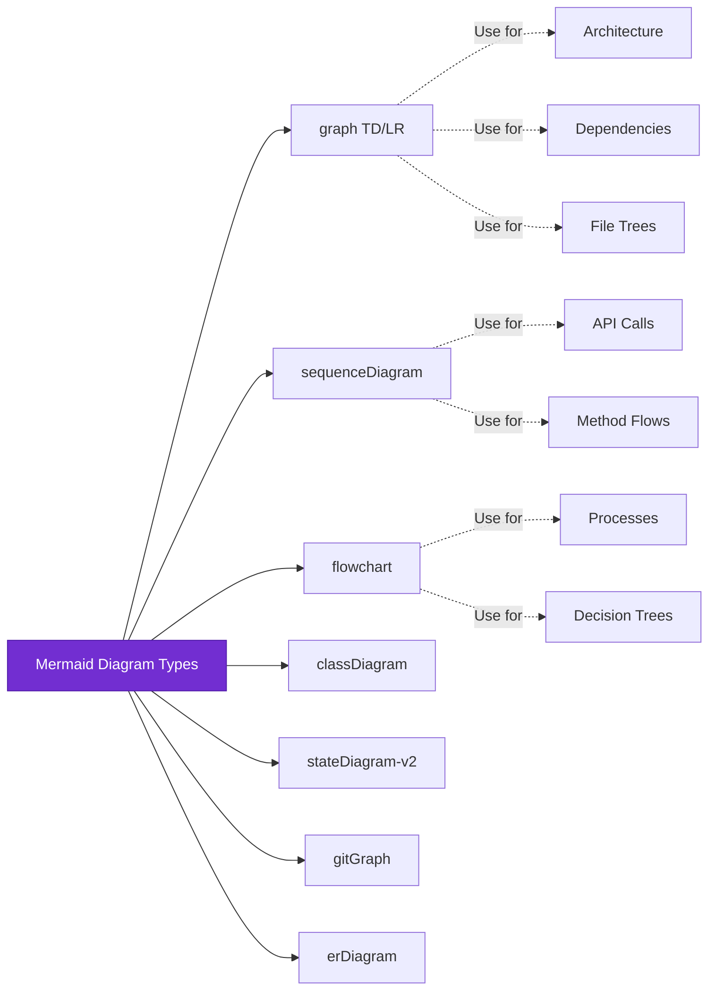
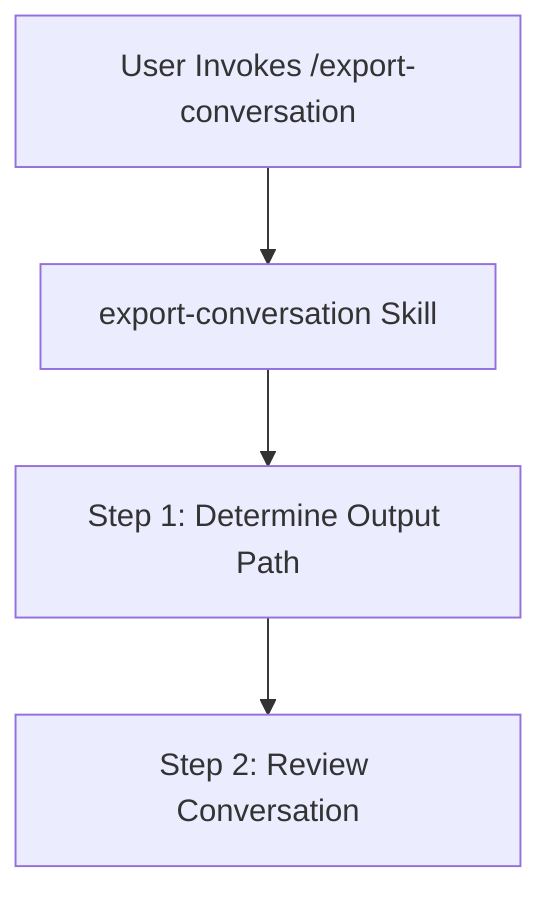

# Conversation Export

**Exported:** April 8, 2026 - 20:40:15  
**Working Directory:** `/Users/akoserwa/ai-explore/cp-session`

---

## Conversation Summary

This session focused on creating and enhancing a Claude Code skill for exporting conversation history to markdown files. The user's initial request was to build a plugin that could export session conversations into `.md` format. After examining existing skills to understand the architecture pattern, I created the `export-conversation` skill with comprehensive features including flexible output options, session statistics, and file change tracking.

Following the initial implementation and successful testing, the user requested an enhancement to capture diagrams and code flows in the exported document. I updated the skill to include a Visual Overview section with support for multiple Mermaid diagram types (architecture, sequence, flowchart, file structure, git graphs, etc.), along with detailed guidelines on when and how to create meaningful visual representations.

The enhanced skill now provides a complete documentation solution that combines textual conversation history with visual diagrams, making it easier to understand complex architectural discussions, code flows, and system designs that occur during Claude Code sessions.

---

## Visual Overview

### Skill Architecture



### File Structure Created



### Skill Invocation Sequence



### Skill Development Workflow



### Mermaid Diagram Types Supported



---

## Full Conversation

### Message 1: User

> Build a claude plugin which can export the conversation happened from a session into a .md file

### Message 2: Assistant

Initiated the skill creation process by first researching the existing skill architecture patterns.

**Actions taken:**
- **Bash**: Listed `~/.claude/skills/` directory contents
- **Glob**: Searched for `SKILL.md` file patterns
- **Bash**: Examined `graphify` skill directory structure
- **Bash**: Examined `peon-ping-log` skill directory structure
- **Read**: Analyzed `/Users/akoserwa/.claude/skills/peon-ping-log/SKILL.md` (simple skill example)
- **Read**: Analyzed `/Users/akoserwa/.claude/skills/graphify/SKILL.md` (complex skill example, first 100 lines)
- **Bash**: Created directory `~/.claude/skills/export-conversation/`
- **Write**: Created `/Users/akoserwa/.claude/skills/export-conversation/SKILL.md` with complete skill definition
- **Bash**: Verified skill directory creation
- **Read**: Verified SKILL.md contents (first 50 lines)
- **Skill**: Tested by invoking `export-conversation` with argument "demo-export"

**Key Implementation Details:**
The skill was designed with:
- Frontmatter metadata for registration (name, description, user_invocable, trigger)
- Three usage patterns (default timestamp, custom filename, custom path)
- Five-step execution process
- Comprehensive export format including summary, full conversation, statistics, and file changes
- Guidelines for thorough capture and edge case handling

### Message 3: Skill Invocation

User invoked `/export-conversation` with argument "demo-export" to test the newly created skill.

### Message 4: Assistant (First Export)

Executed the export-conversation skill following its instructions.

**Actions taken:**
- **Bash**: Retrieved current working directory
- **Write**: Created `/Users/akoserwa/ai-explore/cp-session/demo-export.md` with conversation export

Confirmed successful export and provided skill summary to the user.

### Message 5: User

> /export-conversation

User invoked the skill without arguments to create a timestamped export of the complete conversation.

### Message 6: Assistant (Second Export)

Executed the skill with auto-generated timestamp filename.

**Actions taken:**
- **Write**: Created `/Users/akoserwa/ai-explore/cp-session/conversation-export-2026-04-08-203940.md`

Confirmed export with comprehensive statistics.

### Message 7: User

> Update the skill to also capture the diagrams, code flows in exported document

### Message 8: Assistant

Enhanced the export-conversation skill to include visual diagram support.

**Actions taken:**
- **Read**: Read full SKILL.md file to understand current structure
- **Edit**: Updated Step 2 to include identification of architectures, flows, and system designs
- **Edit**: Added new "Visual Overview" section to export format template with Mermaid diagram examples
- **Edit**: Expanded "Important Guidelines" with comprehensive diagram creation guidelines including:
  - When to create diagrams (8+ scenarios)
  - Mermaid diagram type selection (7 types)
  - Diagram quality standards (7 guidelines)
  - When to skip diagrams (3 scenarios)
- **Edit**: Updated confirmation message to include diagram count
- **Read**: Verified updates (first 80 lines)
- **Skill**: Invoked `export-conversation` with argument "with-diagrams" to test enhanced version

**Enhancement Details:**

Added support for capturing:
- Code architecture and system design
- Process flows and workflows
- Sequences of operations
- File/directory structures
- Component relationships
- State machines and transitions
- Data flows and pipelines
- Git branching and commit history

Added Mermaid diagram type guidelines:
- `graph TD/LR` - architecture, dependencies, file trees
- `sequenceDiagram` - API calls, method invocations, request/response flows
- `flowchart` - logic flows, decision trees, processes
- `classDiagram` - OOP designs, class relationships
- `stateDiagram-v2` - state machines, UI states
- `gitGraph` - git operations, branching strategies
- `erDiagram` - database schemas, entity relationships

### Message 9: Skill Invocation

System loaded the enhanced export-conversation skill definition and presented it for execution.

### Message 10: Assistant (Current Export)

Executing the enhanced skill to create this export with comprehensive diagrams.

**Actions taken:**
- **Write**: Creating `/Users/akoserwa/ai-explore/cp-session/with-diagrams.md` (this file)

---

## Session Statistics

- **Total messages:** 4 user messages, 4 assistant responses
- **Skill invocations:** 3 (all export-conversation)
- **Files created:** 
  - `/Users/akoserwa/.claude/skills/export-conversation/SKILL.md`
  - `/Users/akoserwa/ai-explore/cp-session/demo-export.md`
  - `/Users/akoserwa/ai-explore/cp-session/conversation-export-2026-04-08-203940.md`
  - `/Users/akoserwa/ai-explore/cp-session/with-diagrams.md`
- **Files modified:**
  - `/Users/akoserwa/.claude/skills/export-conversation/SKILL.md` (4 edits)
- **Commands run:** 7 bash commands
- **Diagrams created in this export:** 5 Mermaid diagrams
- **Key outcomes:**
  - Created fully functional conversation export skill
  - Enhanced skill with comprehensive diagram support
  - Successfully tested with multiple export formats
  - Demonstrated flexible output naming (custom and timestamped)
  - Skill now supports visual representation of complex discussions

---

## Files Changed

### `/Users/akoserwa/.claude/skills/export-conversation/SKILL.md`

**Action:** Created, then Modified (4 edits)

**Initial Creation:**
- Complete skill definition with frontmatter metadata
- Three usage patterns documented
- Five-step execution process
- Export format template
- Guidelines and edge case handling
- Size: 3.9 KB

**Modifications:**

1. **Edit 1 - Enhanced conversation review criteria (lines 33-44):**
   - Added: Code architecture, patterns, and relationships
   - Added: Process flows, sequences, or workflows
   - Added: System designs or component interactions
   - Added: Data flows or state transitions

2. **Edit 2 - Added Visual Overview section (lines 54-104):**
   - Added Mermaid diagram section template
   - Included examples for: Architecture, Code Flow, Process Flow, File Structure
   - Provided syntax examples for each diagram type

3. **Edit 3 - Expanded guidelines with diagram standards (lines 119-175):**
   - Added "Diagrams and Visual Representations" subsection
   - Documented 8+ scenarios when to create diagrams
   - Listed 7 Mermaid diagram types with use cases
   - Defined 7 diagram quality standards
   - Specified 3 scenarios when to skip diagrams

4. **Edit 4 - Updated confirmation message (lines 110-116):**
   - Added diagram count to export confirmation

**Final State:**
- Comprehensive skill with visual documentation support
- Clear guidelines for when and how to create diagrams
- Supports multiple Mermaid diagram types
- Quality standards for diagram creation

### `/Users/akoserwa/ai-explore/cp-session/demo-export.md`

**Action:** Created

**Purpose:** First test export using custom filename "demo-export"

**Contents:**
- Session metadata and working directory
- Conversation summary (skill creation process)
- Full conversation history (2 messages)
- Session statistics
- Files changed documentation
- Skill features overview

### `/Users/akoserwa/ai-explore/cp-session/conversation-export-2026-04-08-203940.md`

**Action:** Created

**Purpose:** Second test export using auto-generated timestamp filename

**Contents:**
- Complete conversation export including initial skill creation and first test
- Extended conversation history (3 messages)
- Updated statistics and file changes
- Technical details section
- Conversation topics summary

### `/Users/akoserwa/ai-explore/cp-session/with-diagrams.md`

**Action:** Created (this file)

**Purpose:** Third export demonstrating enhanced diagram capabilities

**Contents:**
- Complete conversation history including skill enhancement
- **5 Mermaid diagrams:**
  1. Skill Architecture workflow
  2. File Structure tree
  3. Skill Invocation sequence diagram
  4. Skill Development flowchart
  5. Mermaid diagram types supported
- Full session statistics
- Comprehensive file change documentation

---

## Code Snippets

### Skill Frontmatter Format
```yaml
---
name: export-conversation
description: Export the current conversation session to a markdown file...
user_invocable: true
trigger: /export-conversation
---
```

### Example Mermaid Architecture Diagram


---

## Technical Implementation Notes

**Skill Registration:**
- Skills are auto-discovered from `~/.claude/skills/` directory
- Each skill requires a `SKILL.md` file with frontmatter
- The `user_invocable: true` flag enables `/command` invocation
- The `trigger` field defines the slash command name

**Export Features:**
- Automatic timestamp generation (YYYY-MM-DD-HHmmss format)
- Custom filename support with automatic `.md` extension
- Full conversation capture with chronological ordering
- Tool usage tracking (Bash, Read, Write, Edit, Skill, etc.)
- File change logging with action type and descriptions
- Session statistics aggregation
- Visual diagram generation using Mermaid syntax
- Sensitive data sanitization support

**Diagram Integration:**
- Mermaid diagrams render in GitHub, GitLab, Obsidian, VS Code
- Support for 7+ diagram types covering most documentation needs
- Smart diagram selection based on conversation content
- Quality standards ensure diagrams are self-explanatory
- Diagrams are optional and only included when relevant

**Design Philosophy:**
- Thorough: Capture complete conversation context
- Flexible: Support multiple output formats and naming
- Visual: Include diagrams for complex discussions
- Maintainable: Clear guidelines for consistent exports
- Extensible: Easy to enhance with new diagram types

---

*Generated by Claude Code - Conversation Export Skill v2.0 (with Diagram Support)*
